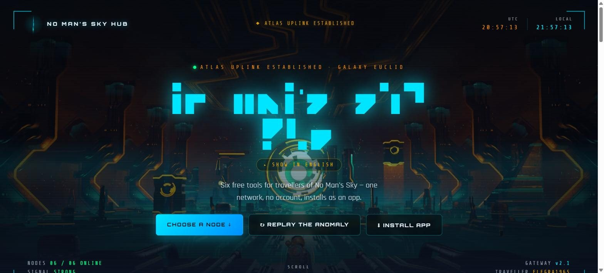
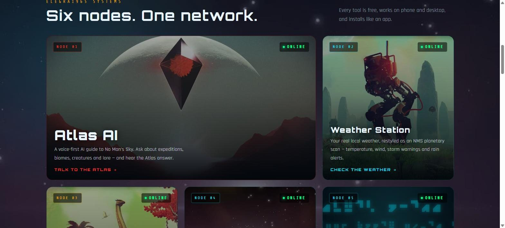
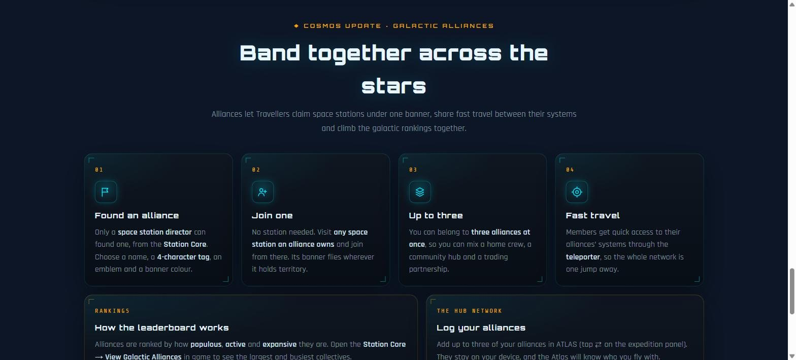

# No Man's Sky Hub

**Live:** [nomansskyhub.app](https://nomansskyhub.app)

The front door to a family of free, fan-made *No Man's Sky* tools. One cinematic page that links every tool, dials portal addresses, and tracks the live expedition. No account, no ads, and it installs as an app.

## What it does

- **Anomaly intro and cinematic hero** with a live clock and a status bar showing the current expedition, read live from the official Galactic Atlas feed.
- **Six nodes, one network.** Image cards for every tool in the family (see below).
- **Portal dialer.** Enter or tap a 12-glyph portal address, pick any of the 256 galaxies, and jump straight to that system on the Galactic Map.
- **Speak like the Atlas.** A built-in alien-alphabet translator.
- **Expedition milestones & tips.** Under the live expedition card, every milestone of the current expedition by phase — what to do, hints and rewards — read live from the No Man's Sky Wiki.
- **Galactic Alliances.** A short guide to alliances from the Cosmos update, with the details (founding one, joining one, the three-alliance limit, alliance teleporters and how the rankings work) behind a **How alliances work** button. A **live top 5** leaderboard (re-checked every 15 minutes while the page is open) (in-game rank, members, stations and 24-hour changes) sits above it, courtesy of [Voyager's Haven](https://havenmap.online) by [u/IAmThe-Ekimo-1920](https://www.reddit.com/user/IAmThe-Ekimo-1920/); the full top 10 runs on the ATLAS alliance ticker.
- **Built for phones too.** On a phone the page is about 40% shorter: a sticky jump bar (Tools · Dialer · Translate · Alliances), the six tool cards in one swipeable row, the dialer's explainer and saved addresses folded behind toggles, the translator opening its NMS-text panel when you tap in, the expedition card tucked into the hero, and a back-to-top button. Desktop is unchanged.
- **Short links.** `nomansskyhub.app/atlas`, `/weather`, `/theme`, `/translator` and `/map` jump to each tool.

## The family

| Tool | Link |
|---|---|
| ATLAS — voice AI companion | [atlas.nomansskyhub.app](https://atlas.nomansskyhub.app) |
| Weather as a planet scan | [weather.nomansskyhub.app](https://weather.nomansskyhub.app) |
| Galactic Map and portal decoder | [map.nomansskyhub.app](https://map.nomansskyhub.app) |
| Theme Pack — icons, wallpapers, font | [theme.nomansskyhub.app](https://theme.nomansskyhub.app) |
| Alphabet Translator | [translator.nomansskyhub.app](https://translator.nomansskyhub.app) |

## How it's built

Plain HTML, CSS and JavaScript with no build step and no framework. Deployed on Netlify straight from this repo: every push to `main` goes live.

| File | What it is |
|---|---|
| `index.html` | The whole page: layout, styles and logic |
| `codex.js`, `expguide.js`, `expguide.css` | Expedition milestones & tips (NMS Wiki data; `codex.js` is shared with ATLAS) |
| `mobile.css`, `mobile.js` | Phone layout: jump bar, swipeable tool cards, dialer folds, back-to-top |
| `alliances.css`, `alliances.js` | The Galactic Alliances section, including the live top 5 |
| `_redirects` | Short links, plus same-origin proxies for the Galactic Atlas API (`/nms-api/`) and the Voyager's Haven alliance leaderboard (`/haven-api/alliances`) |
| `sw.js` | Service worker for install and offline use |
| `manifest.webmanifest` | App install details |
| `assets/` | Backgrounds, intro video, glyph masks, icons and the NMS alphabet font |

## Credits

- Live expedition data: the official Galactic Atlas API by Hello Games
- Expedition milestones: the [No Man's Sky Wiki](https://nomanssky.fandom.com) community (CC BY-SA)
- Real worlds and alliance leaderboard (in ATLAS and NMS Weather): [Voyager's Haven](https://havenmap.online), built and run by [u/IAmThe-Ekimo-1920](https://www.reddit.com/user/IAmThe-Ekimo-1920/)
- NMS Alphabet font by seontonppa (built with FontStruct), used with permission

## Licence

The code is MIT licensed (see `LICENSE`). Game names, glyphs and imagery belong to Hello Games and are not covered by that licence.

*An unofficial, fan-made project. Not affiliated with, sponsored by, or endorsed by Hello Games.*

Built by elegra1965.
